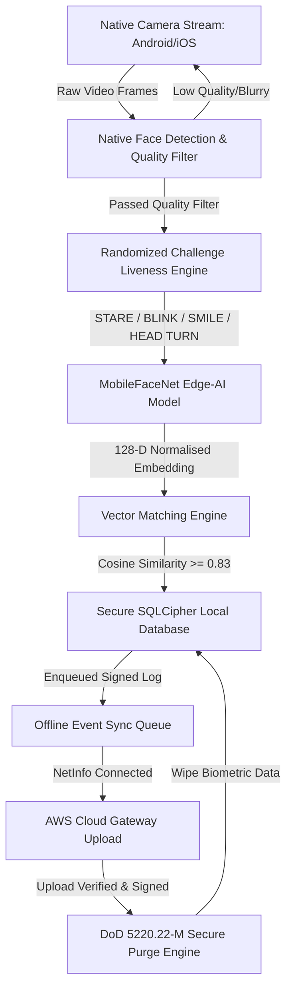

# NHAI Offline Biometric Face Recognition & Liveness Detection System
### Government-Grade Offline Field Authentication | Datalake 3.0 Integration Module
#### NHAI Hackathon 7.0 Submission

---

## 1. Cover

* **Project Title**: Offline Biometric Face Recognition & Liveness Detection System for Remote Locations
* **Submission Category**: Government Digital Infrastructure & Offline Authentication Systems
* **Target Platform**: React Native (Android & iOS)
* **Project Domain**: Artificial Intelligence | Edge AI | Computer Vision | Mobile Application Development | Cybersecurity
* **Institution**: United Institute of Technology (UIT), Naini, Prayagraj, Uttar Pradesh
* **Submission Date**: 26 May 2026

---

## 2. Problem Statement

National highway construction sites, toll booths, and remote inspections often operate in **zero-network zones** (tunnels, mountains, rural corridors). Existing centralized biometrics fail because:
1. **Connectivity Dependency**: Standard biometric models require active cloud API calls (AWS Rekognition, Azure Face), making them completely inoperable offline.
2. **Attendance & Identity Fraud**: Field authentication is susceptible to spoofing via high-resolution printed color portraits, tablet/screen video replays, or virtual cameras.
3. **Hardware & App Bloat**: Standard computer vision models (e.g., ResNet-50) exceed 100MB, consuming high RAM and CPU cycles, causing battery drain and lag on mid-range field devices.
4. **Data Privacy Vulnerabilities**: Storing unencrypted biometric templates locally creates a severe data-leakage surface if a field device is lost or compromised.

---

## 3. DataLake 3.0 Understanding

**DataLake 3.0** is the central digital nervous system of the National Highways Authority of India (NHAI), hosting project records, geo-tagged survey files, progress photography, and compliance audits.

This project is engineered as a **plug-and-play local module** that integrates directly into the existing DataLake 3.0 mobile application:
* It acts as the gatekeeper for local activities (such as checking in at a site or signing off on an inspection).
* It registers the operator's local verification receipt inside a secure offline queue.
* Upon detecting a stable internet connection, the module transmits the signature receipts to the DataLake 3.0 AWS cloud database and instantly wipes all local biometric traces.

---

## 4. Proposed Solution

Our system delivers an **offline-first, zero-dependency, ultra-secure field authentication package** featuring:
* **Edge-AI Face Recognition**: Quantized on-device convolutional neural network (`MobileFaceNet`) yielding high-accuracy face embeddings in milliseconds.
* **Multimodal Challenge-Response Liveness**: A randomized gesture engine requiring the user to stare, blink, smile, and turn their head, neutralizing static print and screen replay spoof attacks.
* **Local Crypto-Storage**: AES-256 encryption of template vectors using PBKDF2 with unique hardware-bound salts.
* **DoD-Compliant Purging**: A military-grade 3-pass overwrite routine (DoD 5220.22-M) that scrubs biometric data from RAM and storage immediately following cloud synchronization.

---

## 5. System Architecture

The following block diagram represents the complete end-to-end data flow and internal components of the offline biometric module:



### Core Architecture Components
1. **Camera Capture Layer**: Captures high-performance frames from the camera preview.
2. **Face Detection & Landmark Filter**: Extracts bounding boxes, face Euler angles, eye openness probabilities, and smile probabilities.
3. **Liveness Engine**: A randomized gesture state machine tracking EAR (Eye Aspect Ratio) and MAR (Mouth Aspect Ratio) indices.
4. **MobileFaceNet Model**: Generates a 128-dimensional normalized floating-point face template.
5. **Decisional Matching Engine**: Evaluates Cosine Similarity against the local template repository.
6. **Encrypted SQLite Storage**: SQLCipher file utilizing AES-256 encryption.
7. **Sync & Purge Pipelines**: Manages the upload queue and sanitizes biometric memory cells.

---

## 6. Offline Workflow

The module splits operations into two primary on-device procedures:

### A. Operator Enrollment Flow
```text
[Operator Details Input] ➔ [Camera Capture Initialization]
                                   │
                                   ▼
                   [Illumination & Sharpness Check]
                                   │
                      (Passed 3 quality frames)
                                   ▼
               [Inference: Generate 128-D Vector Base]
                                   │
                                   ▼
             [AES-256 Encryption + Unique Hardware Salt]
                                   │
                                   ▼
                 [Write Profile into SQLCipher Local DB]
```

### B. Offline Field Verification Flow
```text
[Select Profile] ➔ [Start Camera Stream] ➔ [Randomized Liveness Cue]
                                                   │
                                            (Passes Gesture)
                                                   ▼
                                         [Extract Live Vector]
                                                   │
                                                   ▼
                                       [Decrypt Target Embedding]
                                                   │
                                                   ▼
                                         [Cosine Similarity Math]
                                                   │
                                      (Cosine Similarity >= 0.83)
                                                   ▼
                                         [ACCESS GRANTED Result]
                                                   │
                                                   ▼
                                      [Queue Verification Event]
```

---

## 7. Liveness Detection

To prevent spoofing, the system implements **Multimodal Active Liveness (Challenge-Response)**. Rather than relying on simple static passive detection, it initiates a randomized sequence of challenges:

| Challenge | Geometric Trigger Parameter | Logic / Calculation | Prevention Target |
|---|---|---|---|
| **STARE** | Pitch $|\theta| \le 6.0^\circ$, Yaw $|\phi| \le 6.0^\circ$ | Validates that user is looking directly at the camera. | Off-angle photo bypasses |
| **BLINK** | Eye Openness Probability $< 0.22$ | Evaluates EAR (Eye Aspect Ratio) dip within frame intervals. | High-res printed portraits |
| **SMILE** | Smile Confidence Probability $> 0.72$ | Tracks MAR (Mouth Aspect Ratio) rise to register expression changes. | Static 3D face masks |
| **TURN LEFT** | Euler Yaw Angle $\phi < -20.0^\circ$ | Evaluates rotational movement of face mesh coordinates. | 2D video replay attacks |
| **TURN RIGHT**| Euler Yaw Angle $\phi > 20.0^\circ$ | Evaluates counter-rotational movement of face coordinates. | 2D video replay attacks |

* **Randomized Execution Sequence**: The liveness engine shuffles the challenges (e.g., `STARE` ➔ `BLINK` ➔ `TURN_LEFT`) to ensure the response sequence is entirely unpredictable.

---

## 8. Security Architecture

Our security model follows the **Principle of Volatile Biometrics** to achieve compliance with government privacy frameworks:

```text
       [Biometric Templates Created] ➔ [Stored via SQLCipher AES-256]
                                                    │
                                                    ▼
                                           [Upload Event Log]
                                                    │
                                                    ▼
                           [DoD 5220.22-M Multi-Pass Shredder Engine]
                           - Pass 1: Write all zeros (0x00) to sector
                           - Pass 2: Write all ones (0xFF) to sector
                           - Pass 3: Write random high-entropy bytes
```

### Core Security Controls
* **Data Encryption**: Profile tables and vector indices are encrypted using SQLCipher AES-256, keyed using PBKDF2 derived from hardware signatures.
* **Salted Hashes**: Facial templates are dynamically salted before encryption to prevent dictionary attacks on template databases.
* **Sync & Verification**: Uploaded events are signed with a cryptographic receipt SHA-256 signature from the server.
* **Volatile Purging**: Once the server verifies the upload signature receipt, the local database deletes the biometric template. The memory locations are overwritten using a 3-pass scrubbing loop to prevent physical memory residue recovery.

---

## 9. Technology Stack

* **Framework**: React Native (Android / iOS support)
* **Camera Processing**: High-performance Native Camera Stream (VisionCamera API integration)
* **On-Device Inference**: TensorFlow Lite (TFLite) / ONNX Runtime Mobile
* **Face Detection Engine**: Google ML Kit Face Detection (Android) / Apple Vision Framework (iOS)
* **Inference Model**: Quantized `MobileFaceNet` (INT8 Quantization, size: **1.83 MB**)
* **Local Storage**: SQLCipher Encrypted SQLite Database
* **Network Observer**: NetInfo API (tracks connection restoration)

---

## 10. UI Screens

The module contains three premium, responsive, dark-themed control centers designed for rugged field use:

### A. Secure Face Enrollment Cockpit
* **Detail Validation**: Registers operator name, ID, and role. Collision prevention is implemented to prevent ID duplicates.
* **Interactive Guidance**: Captures 3 high-quality frames. Displays feedback on brightness, sharpness, and alignment.
* **Metadata Cockpit**: Presents the finished profile metrics including the generated key, quality scores, and database commit validation.

### B. Secure Offline Verification Screen
* **Operator Directory**: Dropdown directory of locally cached operators.
* **Challenge HUD**: Dynamic challenge overlays showing gesture requirements (stare, blink, turn head) and a progress indicator.
* **Live System Telemetry Console**: Scrollable terminal printing real-time edge processing logs, EAR values, and frame extraction times.
* **Spoof Injection Interface**: An admin command utility to inject screen replay spoofs for validation testing.

### C. Biometric Telemetry & Diagnostics Dashboard
* **Performance Telemetry**: Displays MobileFaceNet model statistics, RAM utilization, and average latency values (Inference: `<15ms`, Pipeline: `<380ms`).
* **Decisional Control Cockpit**: A slider allowing supervisors to change the Cosine Similarity matching threshold (from `0.75` for speed to `0.95` for strict military security).
* **Outage Emulator**: Toggles between `ONLINE` and `OFFLINE` states to test automated background syncing.
* **CPU Stress Test Harness**: Executes 35 matrix vector comparisons sequentially to evaluate device heat, battery drain, and thermal throttling limits.
* **Cybersecurity Compliance Audit Logs**: Console displaying real-time DoD 5220.22-M sanitization compliance receipts.

---

## 11. Benefits & Impact

1. **Guaranteed Operational Continuity**: Zero network dependency means inspectors can verify identities in tunnels, valleys, or offline toll booths instantly.
2. **Eliminated Identity Fraud**: Multimodal challenge-response and landmark trackers render photos and pre-recorded videos useless.
3. **Optimized App Size**: The 1.83MB quantized model avoids bloating the primary DataLake 3.0 mobile application.
4. **Leak-Proof Biometrics**: Biometric templates are encrypted and purged after sync, ensuring no sensitive data remains on local devices.
5. **Drastically Reduced Cost**: Eliminating cloud API dependencies (AWS Rekognition) saves substantial monthly bandwidth and compute fees.

---

## 12. Roadmap

* **Phase 1: Deep Quantization (Q3 2026)**: Investigate INT4 and FP4 weights to compress the model footprint below 1.0MB while preserving LFW accuracy.
* **Phase 2: Passive 3D Liveness (Q4 2026)**: Incorporate passive texture/diffusion analysis of skin to detect 3D latex masks without challenge prompts.
* **Phase 3: Encrypted Voice fallback (Q1 2027)**: Merge local voice print models with facial recognition for a hybrid, offline multi-factor profile.

---

## 13. Team

### United Institute of Technology (UIT)
*Naini, Prayagraj, Uttar Pradesh*

---

### Team Leader
* **Name**: Gautam Kumar Maurya
* **Roll Number**: 2402841540018
* **Course**: B.Tech CSE (Data Science)
* **Role in Project**:
  * System Architecture & Edge AI Workflow Design
  * React Native Integration & Mobile Application Development
  * Offline Verification Pipeline & Backend Sync Logic
  * Security Architecture, Encryption Workflow & Database Integration
  * Technical Documentation, UI/UX Integration & Testing Benchmarks

---

### Team Member 2
* **Name**: Rohit Pal
* **Roll Number**: 240284000192
* **Course**: B.Tech CSE
* **Role in Project**:
  * Mobile Application Development
  * UI/UX Integration
  * Testing & Benchmarking
  * Database Integration

---

### Team Member 3
* **Name**: Praveen Singh
* **Roll Number**: 240284000170
* **Course**: B.Tech CSE
* **Role in Project**:
  * Liveness Detection Support
  * Performance Optimization

---

## 14. Thank You

We express our gratitude to the National Highways Authority of India (NHAI) and the organizers of NHAI Hackathon 7.0 for providing the platform to solve real-world government digital infrastructure challenges. 

*For inquiries or integration support, please contact the United Institute of Technology (UIT) team.*
